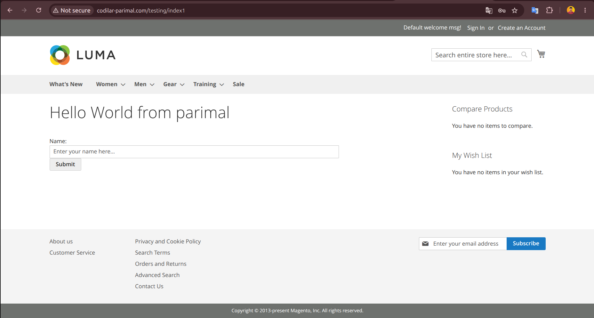

# Codilar BlockPractice Module

This is a lightweight Magento 2 module designed to demonstrate custom routing, controller actions, and frontend block rendering using modern PHP 8.x standards .

## What I Learned & Implemented

* **Module Registration:** Created `registration.php` to register the `Codilar_BlockPractice` component within the Magento 2 architecture .
* **Module Configuration:** Configured `etc/module.xml` to define the module name and versioning .
* **Routing Configuration:** Set up `etc/frontend/routes.xml` to define the frontend router and establish the URL structure (`frontName="testing"`) .
* **Controllers & PageFactory:** Built a frontend controller (`Controller/Index1/Index.php`) using `PageFactory` to initialize and return the page rendering .
* **Block Classes:** Created a custom block (`Block/Hello.php`) to handle PHP logic and pass data to the frontend template .
* **Layout XML:** Configured `view/frontend/layout/testing_index1_index.xml` to map the custom block to the page's `content` container .
* **Template Creation:** Built the frontend view (`view/frontend/templates/hello.phtml`) integrating HTML, forms, and block methods (`$block->getMessage()`) .

## Module URL

Based on the `routes.xml` configuration, the frontend interface is accessible at :
`[your-domain.com]/testing/index1/index`

## Visuals

