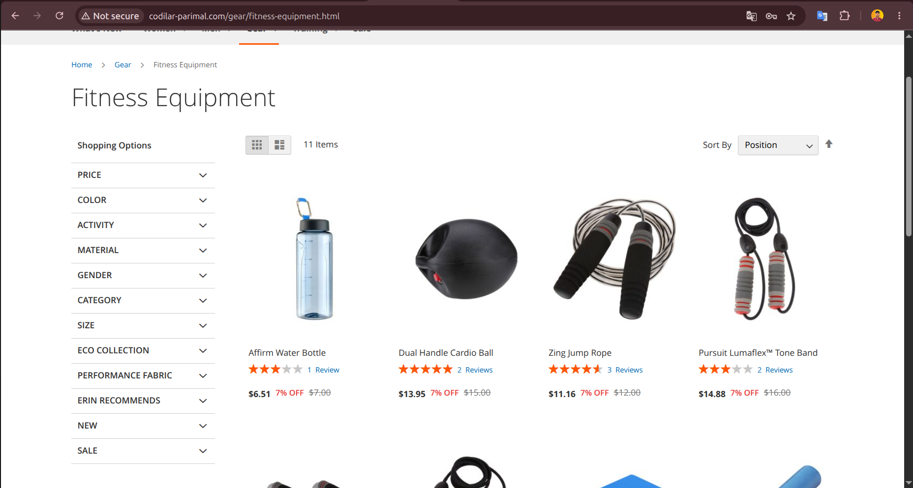
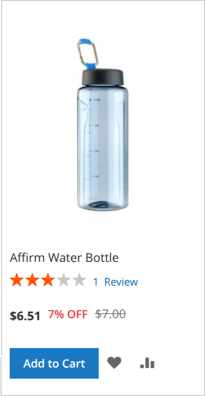
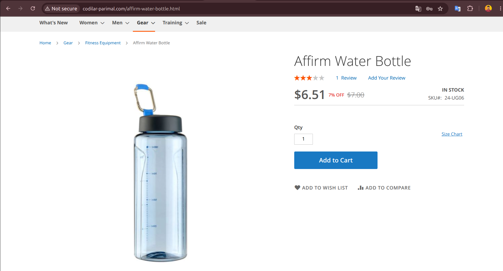
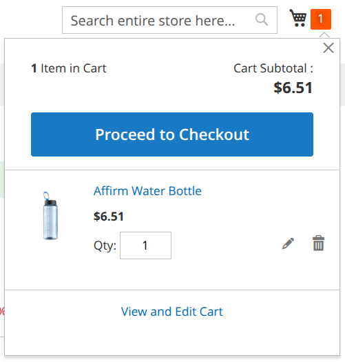

# Codilar CategoryDiscount Module

This Magento 2 module implements a dynamic pricing strategy that applies a **7% discount** to products belonging to a specific target category (Category ID: 5). It utilizes Magento's Plugin (Interceptor) architecture to modify price calculations at the backend level and customizes the frontend display to highlight the savings.

## What I Learned & Implemented

*   **Dependency Injection Configuration:** Configured `etc/di.xml` to define plugins for `FinalPrice`, `FinalPriceBox`, and `Product\Type\Price` to intercept price calculations and rendering logic.
*   **Helper Class Logic:** Created `Helper/Data.php` to centralize business logic, including the target category ID constant and the discount calculation formula.
*   **Backend Price Plugins:**
    *   `FinalPricePlugin`: Modifies the final price value during product loading.
    *   `ProductTypePricePlugin`: Ensures the discounted price is reflected in cart/quote calculations.
*   **Frontend Rendering Plugin:** `PriceBoxPlugin` intercepts the template path to swap the default price template with a custom one when the discount applies.
*   **Custom PHTML Template:** Built `view/frontend/templates/product/price/final_price.phtml` to display the special price, the original struck-through price, and a "X% OFF" label.
*   **CSS Styling:** Added `category-discount.css` via layout XML updates for `catalog_category_view` and `catalog_product_view` to style the new price display elements.

## How It Works

1. **Detection:**  
   When a product page loads or a price is calculated, the `Helper` checks if the product belongs to **Category ID 5**.

2. **Calculation:**  
   If the product belongs to Category ID 5, the `FinalPricePlugin` reduces the price by **7%**.

3. **Display:**  
   The `PriceBoxPlugin` changes the price template to show the **Special Price** alongside the **Old Price**, with a red **"% OFF"** badge.

4. **Cart:**  
   The `ProductTypePricePlugin` ensures that when the product is added to the cart, the item retains the **discounted price**.

## Visuals

