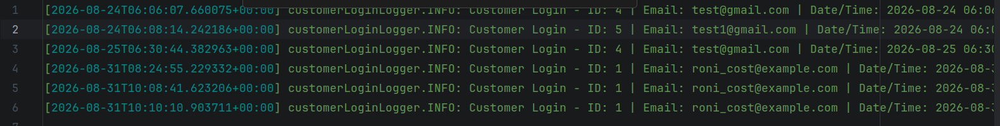

# Codilar CustomerLog Module

This Magento 2 module demonstrates the use of **Event Observers** and **Custom Logging**. It listens for the `customer_login` event and records specific customer details (ID, Email, and Timestamp) into a dedicated log file (`var/log/customer_login.log`) using a custom Monolog handler.

## What I Learned & Implemented

*   **Event Configuration:** Created `etc/frontend/events.xml` to observe the `customer_login` event triggered when a user successfully logs in.
*   **Observer Implementation:** Built `Observer/LogCustomerLogin.php` implementing `ObserverInterface` to capture customer data from the event object.
*   **Custom Logger Handler:** Configured `etc/di.xml` to create a virtual type for a custom log handler that writes specifically to `var/log/customer_login.log`.
*   **Dependency Injection:** Used constructor injection to pass the custom `LoggerInterface` and `DateTime` utility into the observer.
*   **Error Handling:** Implemented `try-catch` blocks within the observer to ensure logging failures do not break the login process.
*   **Modern PHP Standards:** Utilized PHP 8+ features like `declare(strict_types=1)` and constructor property promotion.

## How It Works

1. **Event Trigger:**  
   When a customer logs in through the storefront, Magento dispatches the `customer_login` event.

2. **Observation:**  
   The `LogCustomerLogin` observer catches the `customer_login` event.

3. **Data Extraction:**  
   The observer retrieves the `Customer` object from the event and extracts the **Customer ID** and **Email**.

4. **Logging:**  
   Using the custom logger defined in `di.xml`, it writes a formatted info message containing the **Customer ID**, **Email**, and **UTC timestamp** to `customer_login.log`.

## Visuals

