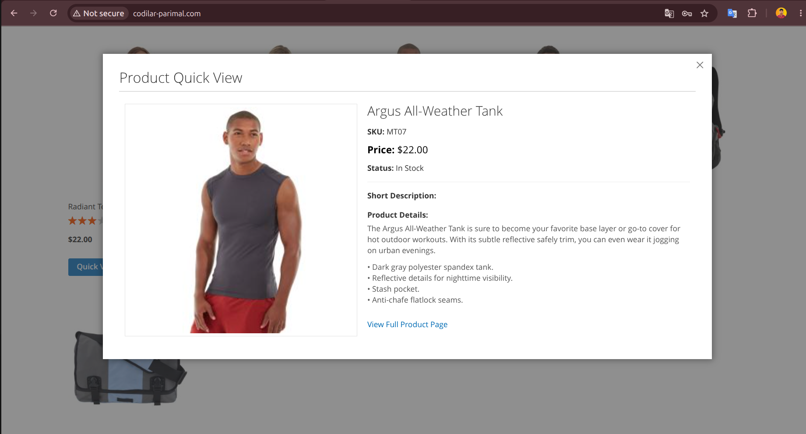

# Codilar QuickView Module

This Magento 2 module adds a "Quick View" feature to product widgets (such as those on category pages or home page carousels). It allows users to view essential product details in a modal popup without leaving the current page, utilizing AJAX for data fetching and Magento UI components for the modal interface.

## What I Learned & Implemented

*   **AJAX Controller:** Created `Controller/Product/View.php` implementing `HttpGetActionInterface` to return product data (Name, Price, Image, Description) as a JSON response.
*   **Custom Routing:** Configured `etc/frontend/routes.xml` with `frontName="quickview"` to handle AJAX requests.
*   **Widget Template Override:** Used `catalog_widget_product_list.xml` to inject a custom template (`grid.phtml`) into the standard product widget renderer.
*   **JavaScript Component:** Built `web/js/quickview.js` using RequireJS to initialize the Magento UI Modal and handle AJAX calls to the custom controller.
*   **LESS Styling:** Added `web/css/source/_module.less` to style the modal content, ensuring a responsive two-column layout for image and details.
*   **Repository Pattern:** Utilized `ProductRepositoryInterface` in the controller to safely fetch product data by ID.

## How It Works

1. **Template Injection:**  
   The module overrides the default widget grid template to add a **"Quick View"** button to each product item.

2. **Modal Initialization:**  
   When the page loads, `quickview.js` initializes a hidden **Magento UI Modal** for each product.

3. **User Interaction:**  
   When a user clicks **"Quick View"**, the modal opens immediately and displays a **"Loading..."** state.

4. **AJAX Fetch:**  
   The JavaScript sends a **GET request** to the `Codilar_QuickView\Controller\Product\View` controller with the **Product ID**.

5. **Data Rendering:**  
   After receiving the JSON response, the modal is populated with the product's **image, name, price, SKU, stock status, and description**.

## Visuals

