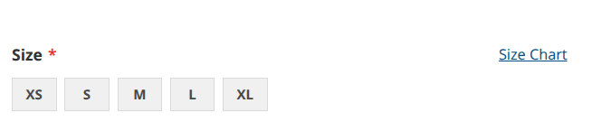
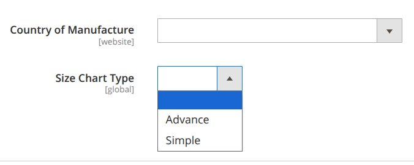
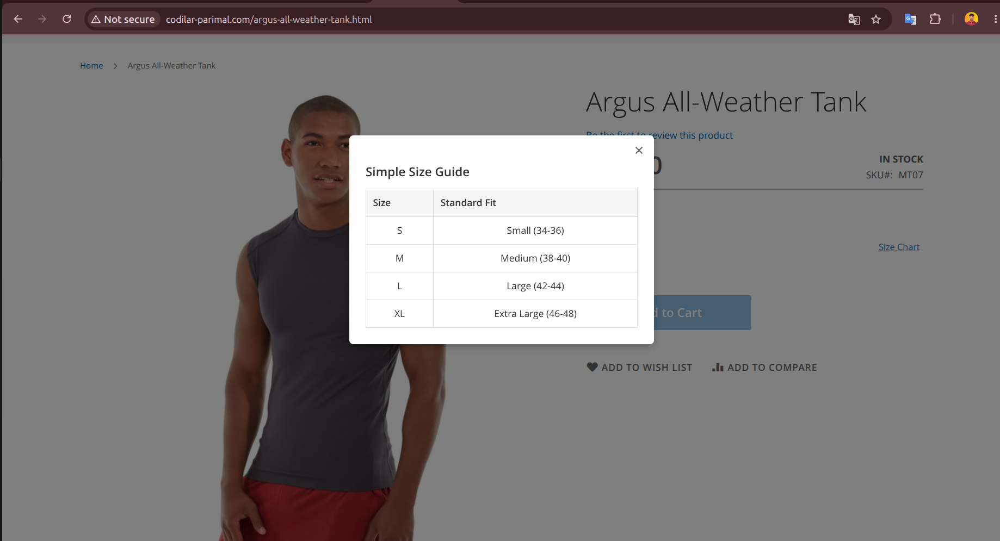
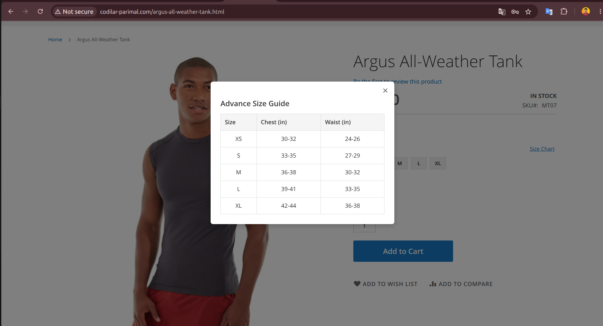

# Codilar SizeChart Module

This Magento 2 module adds a dynamic "Size Chart" feature to product pages. It introduces a custom product attribute (`size_chart_type`) that allows administrators to select between an "Advance" or "Simple" size guide. Based on this selection, the frontend displays a modal popup with the corresponding measurement table.

## What I Learned & Implemented

*   **Data Patch Implementation:** Created `Setup/Patch/Data/AddSizeChartTypeAttributev2.php` to programmatically add a custom dropdown attribute to products using the `DataPatchInterface`.
*   **EAV Attribute Configuration:** Configured the attribute with specific options ('Advance', 'Simple'), scope, and visibility settings within the Admin panel.
*   **Layout Customization:** Used `catalog_product_view.xml` to inject a custom block into the `product.info.main` container and include custom CSS/JS assets.
*   **Conditional Template Logic:** Built `size_chart.phtml` to check the selected attribute value and render the appropriate HTML table structure.
*   **Vanilla JavaScript Modal:** Implemented `web/js/size-chart.js` to handle modal open/close events without relying on heavy jQuery dependencies.
*   **CSS Styling:** Added `web/css/size-chart.css` to style the trigger link and the responsive modal overlay.
## How It Works

1. **Database Update:**  
   The Data Patch adds a new EAV attribute, `size_chart_type`, to the `catalog_product` entity.

2. **Admin Selection:**  
   The merchant selects the desired **size chart type** for each product from the Magento backend.

3. **Frontend Rendering:**  
   On the product page, the template checks the value of `size_chart_type`.

4. **Modal Display:**
    - If **"Advance"** is selected, a detailed table with **Chest/Waist measurements** is displayed.
    - If **"Simple"** is selected, a basic **Standard Fit** table is displayed.

5. **Interaction:**  
   When the customer clicks the **"Size Chart"** link, vanilla JavaScript opens a modal overlay displaying the relevant size chart table.

## Visuals

